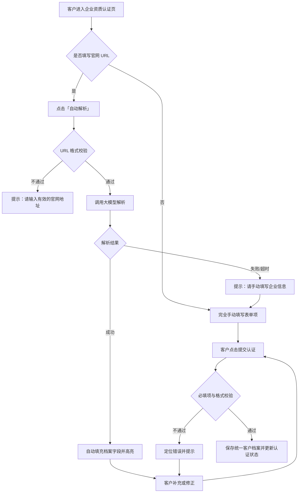

# 用户注册与身份认证产品需求说明书

## 需求概览

### 核心摘要
本需求将订单广场的「谁可以发单、谁可以接单」讲清楚、落下去：**订单广场为客户与用户共同入口**，已登录 CSDN 账号即可进入，**无需在订单广场单独注册**。**首次进入**订单广场时，若该账号**尚未选择身份**，则需**选择身份**（**客户**、**用户**或**仅浏览**）：选择**客户**或**用户**后进行**对应资质认证**，认证完成后再次进入**不再弹出**身份选择或认证页面；选择**仅浏览**时可**暂时跳过身份认证**，支持查看与筛选订单广场全部订单、查看订单详情，但**隐藏【发布订单】与报名竞标入口**，且**该账号下次进入订单广场时需重新弹出身份选择页**让用户再次选择。**单一身份**（针对客户/用户）：同一账号**仅能具备客户或用户身份之一**；**客户**仅能发单、**用户**仅能接单。我们通过**企业资质认证**与**官网大模型解析**，把客户入驻从「到处手填」变成「提交官网、自动带出企业信息、一处维护、处处复用」——解析结果形成**统一客户档案**，订单发布、订单详情、订单广场等涉及客户信息的地方都从这里取数。这样既划清了客户/用户身份与资质边界，又为后续订单、结算与资源绑定打好基础。

### 设计思路
设计上坚持「统一入口、首次进入选择身份、对应资质认证、客户认证提效、信息一源多用、单一身份」：订单广场为客户与用户共同入口，已登录 CSDN 账号即可进入，无需在订单广场单独注册；**账户第一次进入订单广场时**若尚未选择身份，则需**选择身份**（**客户**、**用户**或**仅浏览**）：选择客户或用户后进入**对应资质认证**，认证完成后再次进入不再弹出身份选择或认证页面；选择**仅浏览**则暂时跳过认证，可查看与筛选订单、查看订单详情，但隐藏【发布订单】与报名竞标入口，下次进入订单广场时**重新弹出身份选择页**。同一账号**仅能具备一种发单/接单身份**（客户仅能发单、用户仅能接单）。客户认证支持「官网 URL + 大模型解析」优先，解析失败或无官网时降级为纯手动填写，不阻塞认证；统一客户档案作为客户信息的唯一数据源，订单侧只引用不重复录入，并在认证环节与档案管理中支持补充和修正，与现有 CSDN 账号体系复用、不另建一套登录注册。

### 历史实现参考
本需求严格依据《CSDN 订单管理系统整体方案》第 4 章「范围与边界」中「账号与身份」、第 5 章「整体方案」及第 6.1 节「用户注册与身份认证」拆分，统一入口（订单广场为共同入口、已登录即可进入无需单独注册）、**首次进入订单广场选择身份（客户/用户/仅浏览）**、**仅浏览**为本次新增选项（暂时跳过认证、可查看与筛选订单及订单详情、隐藏发布订单与报名竞标、下次进入重新弹窗）、**单一身份**（客户仅能发单、用户仅能接单）的表述与方案一致。本项目 `docs/history/` 下未发现相关历史需求文档，因此以整体方案为唯一设计来源；文档结构与验收准则格式参考了工作区内 CSDN会议功能下的需求说明书，保持需求文档风格与 Given-When-Then/Gherkin 验收方式一致。

---

# 第1章：概述

## 1.1 术语表

| 术语 | 英文（如需） | 描述 |
|------|--------------|------|
| 客户 | Order Publisher / Requester | 在订单平台上发布订单的企业或组织；使用订单广场时**无需单独注册**，已登录 CSDN 账号即可进入。**首次进入**订单广场时若尚未选择身份，则需**选择身份**（客户、用户或仅浏览），选择**客户**后完成**企业资质认证**（可提交公司官网，由后台大模型解析输出客户信息与资质）。认证完成后再次进入订单广场不再弹出身份选择或认证页面。该账号**固定为客户身份**，**仅具备发单能力、不可接单**；在订单广场可见【发布订单】按钮并可发单，拥有订单看板、订单管理及【我的账单】等客户侧入口。 |
| 用户 | Order Taker / Contractor | 在平台上承接任务订单的个人或团队；使用订单广场时**无需重复注册**，**已登录 CSDN 账号**即可进入。**首次进入**订单广场时若尚未选择身份，则需**选择身份**（客户、用户或仅浏览），选择**用户**后需完成**个人/团队能力与资质**的填写与维护。认证完成后再次进入订单广场不再弹出身份选择或认证页面。该账号**固定为用户身份**，**仅具备接单能力、不可发单**；在订单广场不可见【发布订单】按钮、可接单，拥有【我的订单】、【我的账单】等用户侧入口。 |
| 仅浏览 | Browse Only | **身份选择页的第三项**：用户选择后**暂时跳过身份认证**，不进入客户或用户资质流程。当次可**查看与筛选订单广场中的全部订单**、**查看订单详情**；系统**隐藏【发布订单】与报名竞标入口**。该选择**不持久化**（或仅作当次/短期标记）：**该账号下次进入订单广场时，需重新弹出身份选择页**让用户再次选择客户、用户或仅浏览。 |
| 单一身份 | Single Role | 同一 CSDN 账号**仅能具备客户或用户身份之一**（完成对应认证后）；选择客户并完成企业资质认证后该账号固定为客户身份，仅能发单、不可接单；选择用户并完成用户资质后该账号固定为用户身份，仅能接单、不可发单。**选择「仅浏览」不视为固定身份**，下次进入需重新选择。本期不支持同一账号双身份共存。 |
| 企业资质认证 | Enterprise Qualification | 客户在**首次进入订单广场并选择客户身份后**完成的身份与资质核验，包括提交公司官网 URL 由大模型解析、或/并补充企业名称、行业、简介、资质证明等信息；认证结果形成该客户在平台上的**统一客户档案**。 |
| 官网解析 / 客户信息解析 | Website Parsing / Customer Info Extraction | 客户认证时提交公司官网 URL，后台通过大模型能力自动抓取并解析官网内容，输出结构化客户信息与资质（如企业名称、行业、简介、资质等），作为该客户在平台上的统一档案及订单等处的展示来源。 |
| 统一客户档案 | Unified Customer Profile | 经企业资质认证（含官网解析）后形成的客户结构化信息集合；订单发布、订单详情、订单广场等所有涉及「客户相关信息」的展示与数据均采用该档案，无需客户在每笔订单或多处重复填写。 |
| 用户能力与资质 | Contractor Capability & Qualification | 用户（接单方）在**首次进入订单广场并选择用户身份后**维护的个人或团队能力背景介绍、所取得资质证书等信息的结构化填写与展示；与客户身份互斥，同一账号仅能具备一种身份。 |
| CSDN 账号登录 | CSDN Account Login | 用户使用订单广场时的登录方式：复用 CSDN 既有账号体系与登录态，无需在订单广场重复注册。 |

## 1.2 修订记录

| 版本 | 内容 | 负责人 | 更新时间 | 备注 |
|------|------|--------|----------|------|
| 1.0 | 初稿，基于《CSDN 订单管理系统整体方案》第 6.1 节及第 4 章「账号与身份」拆分 | — | 2025-03-07 | — |
| 1.1 | 按整体方案更新：统一入口（订单广场共同入口、已登录即入无需单独注册）、按操作触发资质、支持双身份 | — | 2025-03-07 | 与方案 6.1.2 一致 |
| 1.2 | 按整体方案 2.3 恢复单一身份：首次进入订单广场需选择身份（客户/用户二选一）并完成对应资质认证，认证后再次进入不弹窗；单一身份（客户仅发单不可接单、用户仅接单不可发单）；移除双身份表述 | — | 2025-03-09 | 与方案 6.1 单一身份一致 |
| 1.3 | 新增身份选项「仅浏览」：身份选择页支持客户/用户/仅浏览；选择仅浏览可暂时跳过认证，可查看与筛选订单、查看订单详情，隐藏发布订单与报名竞标入口，下次进入订单广场时重新弹出身份选择页 | — | 2025-03-10 | 满足先浏览后决策的体验 |

## 1.3 背景和价值

**背景与痛点**：  
当前供需双方在 CSDN 平台上缺乏统一的「发单—接单—交付—结算」闭环。企业客户（发单方）与个人/团队（接单方）需有清晰的资质区分与准入方式：**订单广场为客户与用户共同入口**，已登录 CSDN 账号即可进入，无需在订单广场单独注册。**首次进入**订单广场时，若该账号**尚未选择身份**，则需**选择身份**（**客户**、**用户**或**仅浏览**）：选择客户或用户后进行**对应资质认证**，认证完成后再次进入**不再弹出**身份选择或认证页面；选择**仅浏览**可暂时跳过认证，可查看与筛选订单及订单详情，但隐藏【发布订单】与报名竞标入口，下次进入需重新选择身份。**单一身份**：同一账号仅能具备客户或用户身份之一（完成认证后），客户仅能发单、用户仅能接单。若客户认证过程繁琐、信息在多处重复填写，会降低客户入驻意愿；通过「官网 + 大模型解析」与统一客户档案，减少手填与重复；用户侧在首次选择用户身份后完成能力与资质维护，与 CSDN 既有账号体系统一，降低使用门槛。

**业务价值**：  
1. **统一入口、准入可控**：订单广场为客户与用户共同入口，已登录 CSDN 账号即可进入，无需在订单广场单独注册；**首次进入时选择身份（客户、用户或仅浏览）**，选择客户或用户后完成**对应资质认证**则再次进入不再弹窗；选择**仅浏览**可暂时跳过认证、查看与筛选订单及订单详情，但隐藏【发布订单】与报名竞标入口，下次进入需重新选择身份，明确发单与接单的身份与资质边界，便于后续订单、结算与资源绑定等能力按角色生效。  
2. **客户认证提效**：客户在**首次进入订单广场并选择客户身份后**进入企业资质认证；支持提交公司官网 URL，由后台大模型自动解析并输出客户信息与资质，形成统一客户档案，减少手工录入与重复填写，提升认证与发单效率。  
3. **信息一致与复用**：订单发布、订单详情、订单广场等涉及客户相关信息的展示与数据均采用统一客户档案，保证数据一致并避免客户在每笔订单或多处重复填写。  
4. **用户身份与资质清晰**：用户在**首次进入订单广场并选择用户身份后**完成个人/团队能力与资质的填写与维护，认证完成后再次进入不再弹窗；该账号固定为用户身份，仅能接单、不可发单，在订单广场不可见【发布订单】按钮，便于在订单广场被客户发现与选标。  
5. **单一身份边界清晰**：同一账号仅能具备客户或用户身份之一，客户仅能发单不可接单、用户仅能接单不可发单，避免角色混淆与权限交叉。  
6. **为订单与运营能力打基础**：客户档案与用户能力/资质数据为订单发布、订单广场筛选、运营端业务看板等提供基础数据支撑。

---

# 第2章：功能需求

## 2.1 身份与入口（客户 / 用户 / 仅浏览）

### 场景描述

**场景 1：企业首次进入订单广场并选择客户身份发单**  
某企业市场负责人希望在公司官网发布的技术活动之外，在 CSDN 订单广场发布开发任务。其已登录 CSDN 账号即可进入订单广场，无需在订单广场单独注册。**第一次**进入订单广场时，因该账号尚未选择身份，系统展示**身份选择页**（客户、用户或仅浏览）；其选择**客户**后，系统引导进入企业资质认证与资料填写流程；认证时可提交公司官网 URL，由系统自动解析企业信息，无需逐项手填。完成客户资质后，该账号即**固定为客户身份**，拥有订单看板、订单管理及【我的账单】等客户侧入口，在订单广场可见【发布订单】并可发单、**不可接单**。再次进入订单广场时不再弹出身份选择或认证页面。

**场景 2：开发者首次进入订单广场并选择用户身份接单**  
一名已在 CSDN 上活跃的开发者希望承接订单广场上的开发任务。其已登录 CSDN 账号即可进入订单广场，无需重复注册。**第一次**进入订单广场时，因该账号尚未选择身份，系统展示**身份选择页**（客户、用户或仅浏览）；其选择**用户**后，系统引导进入个人/团队能力与资质补充流程，需填写或维护能力背景、资质证书等信息。完成用户资质后，该账号即**固定为用户身份**，拥有【我的订单】、【我的账单】等用户侧入口，在订单广场**不可见【发布订单】按钮**、可接单。再次进入订单广场时不再弹出身份选择或认证页面。用户也可在完成身份选择后、进入资质补充流程前或过程中，于「我的」或设置中提前维护能力与资质（具体入口在需求或交互中定义）。

**场景 3：已选身份用户再次进入订单广场**  
已选择客户身份并完成企业资质认证的账号，再次进入订单广场时直接进入订单广场页面，不再弹出身份选择或认证页面；该账号仅可见【发布订单】并可发单，不可接单。已选择用户身份并完成用户资质的账号，再次进入订单广场时直接进入订单广场页面，不再弹出身份选择或认证页面；该账号不可见【发布订单】，可接单。

**场景 4：访客选择仅浏览，暂时跳过认证**  
用户首次进入订单广场时，在身份选择页选择**仅浏览**。系统**不进入**客户或用户资质认证流程，直接进入订单广场；该用户当次可**查看与筛选订单广场中的全部订单**、**查看订单详情**，但系统**隐藏【发布订单】与报名竞标入口**（及发单/接单相关入口）。该选择**不持久化**：**该账号下次进入订单广场时，系统再次弹出身份选择页**，让用户重新选择客户、用户或仅浏览。

### 2.1.1 基本事件流程

#### 主业务流程

**前置条件**：  
- **统一入口**：订单广场为**客户与用户共同入口**，**已登录 CSDN 账号即可进入**，无需在订单广场单独注册；所有账户从该入口进入【订单广场】页面。  
- **尚未选择身份**：当前账号在订单广场侧尚未完成「身份选择 + 对应资质认证」时，首次进入订单广场需先完成身份选择；若上次选择为**仅浏览**，则视为尚未完成身份选择，再次进入时仍展示身份选择页。  
- **已选择身份并完成认证**：已选择客户或用户并完成对应资质认证的账号，再次进入订单广场时不再弹出身份选择或认证页面。

**首次进入订单广场（尚未选择身份）流程**：  
1. 用户已登录 CSDN 账号，从统一入口进入订单广场。  
2. 系统判断该账号**尚未选择身份**（或上次选择为**仅浏览**），展示**身份选择页**，提示用户选择**客户**、**用户**或**仅浏览**（三选一）。  
3. **若用户选择「客户」**：  
   - 系统引导进入**企业资质认证**与资料填写流程（见 2.2）；认证与必填项通过后，客户资质开通，该账号**固定为客户身份**。  
   - 后续该账号在订单广场可见【发布订单】按钮并可发单，**不可接单**；拥有订单看板、订单管理及【我的账单】等客户侧入口。  
4. **若用户选择「用户」**：  
   - 系统引导进入**个人/团队能力与资质**补充流程（见 2.3）；填写或维护完成并保存后，该账号**固定为用户身份**。  
   - 后续该账号在订单广场**不可见【发布订单】按钮**，可接单；拥有【我的订单】、【我的账单】等用户侧入口。  
5. **若用户选择「仅浏览」**：  
   - 系统**不进入**任何资质认证流程，直接进入订单广场页面。  
   - 当次支持**查看与筛选订单广场中的全部订单**、**查看订单详情**；**隐藏【发布订单】与报名竞标入口**（及发单/接单相关能力入口）。  
   - 该选择**不持久化**（或仅作当次/短期标记）：**该账号下次进入订单广场时，系统再次展示身份选择页**，用户需重新选择客户、用户或仅浏览。  
6. **认证完成后（仅针对选择了客户或用户并完成认证的账号）**：再次进入订单广场时，系统**不再弹出**身份选择页或认证/资质补充页，直接进入订单广场页面；页面展示内容按身份区分（客户见【发布订单】可发单不可接单，用户不可见【发布订单】可接单）。

**单一身份**：同一账号**仅能具备客户或用户身份之一**（完成对应认证后）；一旦选择并完成对应资质认证，该身份即固定，本期不支持身份切换或双身份共存。**选择「仅浏览」不视为固定身份**，不写入客户/用户资质，下次进入需重新选择。

**后置条件**：  
- **客户**：平台内存在该账号的客户资质记录及统一客户档案，该账号固定为客户身份，可正常发单、不可接单。  
- **用户**：该账号具备用户资质并固定为用户身份，可维护能力与资质并可被客户看到、可参与竞标，不可发单。  
- **仅浏览**：当次可进入订单广场，可查看与筛选订单、查看订单详情；【发布订单】与报名竞标入口隐藏；下次进入订单广场时需重新展示身份选择页。

**系统响应与提示**：  
- 订单广场入口需明确：已登录 CSDN 账号即可进入，无需在订单广场单独注册。  
- **首次进入且尚未选择身份（含上次选择仅浏览）**：展示身份选择页，文案可包含「请选择您的身份：客户（发单）、用户（接单）或 仅浏览（暂不认证，仅可查看订单）」；选择客户或用户后进入对应认证/资质流程，选择仅浏览后直接进入订单广场并隐藏发单/接单入口。  
- **选择客户后**：引导进入企业资质认证流程，文案可包含「完成企业认证后即可发布订单」。  
- **选择用户后**：引导进入能力与资质补充流程，文案可包含「补充资质信息后可参与接单」。  
- **选择仅浏览后**：可直接进入订单广场，文案可包含「您正在以仅浏览模式使用，可查看与筛选订单；需要发单或接单时，下次进入可重新选择客户或用户身份」。

#### 扩展事件流程

- **客户已选身份且认证通过**：再次进入订单广场时直接进入订单广场页面，可见【发布订单】并可发单，不重复认证。  
- **用户已选身份且资质已维护**：再次进入订单广场时直接进入订单广场页面，不可见【发布订单】、可接单；可在「我的」或用户资料中继续维护能力与资质。  
- **上次选择仅浏览**：再次进入订单广场时，系统**仍展示身份选择页**，用户需重新选择客户、用户或仅浏览；不因上次选择仅浏览而直接进入订单广场。

#### 异常事件流程

- **账号已具备客户资质再次进入认证**：若该账号已存在客户身份且认证通过，不应再次出现身份选择页；若误入认证页，系统应识别并引导至发单入口，并提示「您已具备客户资质，可直接发布订单」。  
- **用户未登录**：未登录用户访问订单广场时，仅可浏览公开订单列表（若产品允许）；点击报名、竞标或「我的订单」等需登录的操作时，引导使用 CSDN 账号登录。  
- **CSDN 登录失败**：按 CSDN 现有登录异常处理（如账号不存在、密码错误、风控拦截等），由既有账号体系返回提示，本需求不改变其逻辑。

### 2.1.2 需求波及分析

- **影响模块**：订单广场入口、**身份选择页**（首次进入或上次选择仅浏览时）、企业资质认证页（客户）、用户资质补充流程（用户）、**订单广场列表与订单详情页**（对仅浏览身份隐藏【发布订单】与报名竞标入口）；订单广场需按身份控制【发布订单】与报名竞标入口可见性及发单/接单权限。  
- **数据影响**：需客户主数据、客户认证/档案表；用户侧复用 CSDN 账号，需用户扩展信息表（能力与资质）；需**账号身份标识**（客户/用户/仅浏览）；选择**仅浏览**时不创建客户或用户资质记录，需能识别「上次选择为仅浏览」或「未完成认证」以便下次进入时再次展示身份选择页（可为会话级、短期标记或轻量持久字段，具体由实现约定）。  
- **业务规则影响**：明确「订单广场为共同入口、已登录即可进入无需单独注册」；**首次进入订单广场时若尚未选择身份（含上次选择仅浏览）则展示身份选择页（客户/用户/仅浏览），选择客户或用户后进入对应资质认证，认证完成后再次进入不再弹窗；选择仅浏览则暂时跳过认证，可查看与筛选订单、查看订单详情，隐藏【发布订单】与报名竞标入口，下次进入需重新选择身份**；**单一身份**（客户仅能发单不可接单、用户仅能接单不可发单）。  
- **历史文档查阅记录**：  
  - 查阅的整体方案文档：`CSDN订单系统/docs/CSDN订单管理系统整体方案.md`（工作区相对路径）  
  - 参考功能：第 4 章「范围与边界」中「账号与身份」、第 6.1 节「用户注册与身份认证」、术语与入口描述  
  - 设计一致性保证：统一入口、**首次进入选择身份（客户/用户/仅浏览）**、**仅浏览**为本次细化（暂时跳过认证、可查看与筛选及详情、隐藏发单与报名竞标、下次进入重新弹窗）、**单一身份**（客户仅发单、用户仅接单）与整体方案 6.1.2 表述一致；未扩展方案未提及的双身份或身份切换。

---

## 2.2 客户企业资质认证（含官网提交与大模型解析）

### 场景描述

**场景 1：官网一键解析**  
客户在认证环节填写公司官网 URL（如 https://www.xxx.com），点击「自动解析」。后台调用大模型能力抓取并解析官网内容，输出企业名称、行业、简介、资质证明等结构化信息，并自动填充到客户档案表单项中；客户仅需核对或少量补充即可提交，无需逐项手填。

**场景 2：无官网或解析失败**  
客户无官网或官网不可访问（如反爬、权限限制），或解析超时/失败。系统提示「无法自动解析，请手动填写企业信息」，展示与解析结果相同结构的表单项，由客户手工填写必填项后提交。

**场景 3：解析结果不完整**  
大模型解析出的部分字段为空或存疑。系统将已解析字段自动填充并高亮展示「已自动填充」；未解析出的必填项保持为空并标注「请补充」，客户在认证环节补充或修正后提交。

### 2.2.1 基本事件流程

#### 主业务流程

**前置条件**：用户**首次进入订单广场并选择客户身份**，已进入企业资质认证流程；后台大模型解析服务可用（或降级为纯手工填写）。

**流程描述**：  
1. **进入认证页**：客户在**首次进入订单广场并选择客户身份后**，被引导至「企业资质认证」页面。  
2. **提交官网 URL（可选）**：  
   - 客户在「公司官网」输入框中填写公司官网 URL。  
   - 客户点击「自动解析」按钮。  
3. **大模型解析**：  
   - 系统校验 URL 格式合法（如 http(s) 开头、域名格式）。格式非法时提示「请输入有效的官网地址」。  
   - 系统调用后台大模型能力，对官网进行抓取并解析，输出结构化客户信息与资质（如企业名称、行业、简介、资质证明等）。解析输出字段与认证项在「数据项描述」中定义；**认证项、解析输出字段的完整枚举及审核方式、人工复核规则需在实现前与业务确认，此处给出结构占位**。  
4. **结果填充与展示**：  
   - 解析成功后，系统将解析结果映射到客户档案表单项，自动填充并高亮「已自动填充」；未解析出的字段保持为空，客户可补充或修正。  
   - 解析失败或未提交 URL：不填充，客户完全手动填写表单项。  
5. **补充与修正**：客户在认证环节对自动填充或手填内容进行编辑；若解析结果需补充或修正，支持在本环节完成（具体可编辑字段与校验规则见 2.3 数据项）。  
6. **提交认证**：客户点击「提交认证」。系统执行必填项与格式校验；校验通过后，解析结果与客户填写内容一并保存为该客户的**统一客户档案**；认证状态更新为「待审核」或「已通过」（审核方式与人工复核规则见下）。  
7. **审核方式**：认证项、审核方式（自动通过/人工审核）及人工复核规则在需求文档中细化。**此处信息需与业务确认**：若为人工审核，则运营端需具备客户认证审核入口，审核通过后客户方可发单；若为自动通过，则提交即生效。  

**后置条件**：该客户在平台拥有**统一客户档案**，档案内容用于订单发布、订单详情、订单广场等所有涉及客户相关信息的展示与数据填充；客户认证状态为已通过（或按业务规则进入待审核）。

**系统响应与提示**：  
- URL 格式错误：「请输入有效的官网地址」。  
- 解析中：展示「正在解析官网信息，请稍候」等加载状态；支持超时（如 30 秒）后提示「解析超时，请手动填写或稍后重试」。  
- 解析失败：「无法自动解析该链接，请手动填写企业信息」。  
- 提交校验失败：定位到首个不符合项，红字提示具体原因（如「企业名称为必填项」）。



#### 扩展事件流程

- **仅手动填写**：客户不填写官网 URL，直接填写全部表单项后提交，系统不调用解析，仅做校验与保存。  
- **多次解析**：客户修改官网 URL 后再次点击「自动解析」，系统重新调用解析并覆盖此前解析结果；客户已手动修改的字段是否保留由产品规则决定（建议：再次解析时提示「将覆盖当前已填充内容，是否继续」）。

#### 异常事件流程

- **大模型服务不可用**：系统提示「智能解析暂不可用，请手动填写企业信息」，不阻塞认证流程。  
- **官网不可访问（403/404/超时）**：解析失败，提示「无法访问该链接，请检查链接或手动填写」。  
- **必填项未填**：提交时校验，提示「请完善必填项」并定位到具体字段。  
- **敏感词或违规内容**：若业务要求对客户填写内容做敏感词或违规校验，校验不通过时提示「存在不合规内容，请修改后重试」；具体规则与提示文案需与业务确认。

### 2.2.2 数据项描述（客户认证与统一档案）

以下为业务与逻辑层面数据项；具体表结构、字段类型与长度由实现设计确定。**解析输出字段、认证项完整列表及审核方式需在实现前与业务补充确认**，表中标注「待确认」处为占位。

| 字段名（中文） | 字段名（英文） | 数据类型/长度 | 是否必填 | 前端展示 | 默认值 | 说明（校验/取值/计算） | 界面/控件说明 | 备注 |
|----------------|----------------|----------------|----------|----------|--------|------------------------|----------------|------|
| 公司官网 URL | website_url | 字符串，建议 500 | 否 | 是 | — | 格式为有效 http(s) URL；用于触发大模型解析 | 单行输入框，可带「自动解析」按钮 | 解析结果写入下列字段，不单独作为档案展示主字段 |
| 企业名称 | company_name | 字符串，建议 200 | 是 | 是 | — | 非空；可来自解析或手填 | 单行输入框 | 解析输出字段之一 |
| 行业 | industry | 字符串或枚举，建议 100 | 待确认 | 是 | — | 可选枚举或自由填写，依业务配置 | 下拉或输入框 | 解析输出字段之一；枚举值需业务确认 |
| 企业简介 | company_intro | 文本，建议 2000 | 待确认 | 是 | — | 长度上限、敏感词等依业务 | 多行文本框 | 解析输出字段之一 |
| 资质证明 | qualification_info | 文本或结构化，建议 2000 | 待确认 | 是 | — | 可为文本描述或附件引用；具体认证项在需求中细化 | 多行文本或上传+说明 | 解析输出字段之一；认证项、审核方式、人工复核规则需补充确认 |
| 认证状态 | certification_status | 枚举 | 是 | 是（运营/客户） | 待审核 | 待审核/已通过/已拒绝；审核方式（自动/人工）需业务确认 | 状态标签 | — |
| 统一客户档案 | — | — | — | — | — | 上述字段及扩展字段共同构成；订单等处展示与填充均取自该档案 | — | 档案支持在认证环节或档案管理中编辑，见 2.3 |

**说明**：  
- 认证项、解析输出字段的完整定义、审核方式及人工复核规则在整体方案中约定「在需求文档中细化」。当前表中列出典型字段作为占位，**实现前需与业务确认完整认证项列表、解析接口输出结构与审核流程**。  
- 若解析结果需补充或修正，支持客户在认证环节或档案管理中进行编辑；编辑权限、可编辑字段及校验规则在 2.3 中说明。

### 2.2.3 需求波及分析

- **影响模块**：客户注册/认证页、客户档案管理、订单发布（预填客户信息）、订单详情与订单广场（展示客户信息）、运营端客户/认证审核（若为人工审核）。  
- **数据影响**：客户主表、客户认证/档案表；需预留与大模型解析服务对接的接口与字段映射。  
- **业务规则影响**：明确官网解析的触发条件、解析结果与档案字段的映射、解析失败时的降级策略；审核方式与人工复核规则待确认。  
- **历史文档查阅记录**：同 2.1.2；本功能对应整体方案 6.1.2「客户认证」与 4.1「客户：…提交公司官网…大模型自动解析…」；触发时机为**首次进入订单广场并选择客户身份后**，非点击【发布订单】时。

---

## 2.3 用户登录与能力/资质维护

### 场景描述

**场景 1：CSDN 账号登录使用订单广场**  
用户打开订单广场或「我的订单」入口，未登录时系统引导使用 CSDN 账号登录；登录成功后即可浏览订单、报名/竞标，无需在订单广场重复注册。

**场景 2：首次选择用户身份后维护能力与资质以提升被选标概率**  
用户在**首次进入订单广场并选择用户身份后**进入能力与资质补充流程，在「个人中心」或「用户资料」中填写或维护个人/团队能力背景介绍、所取得资质证书等信息；这些信息在订单报名列表、订单详情等场景向客户展示，便于客户选标时参考。用户可在资质维护页**开启【团队】配置项**（**默认关闭**），开启后按团队身份填写团队名称等团队相关信息；未开启时仅展示与保存个人能力与资质。

### 2.3.1 基本事件流程

#### 主业务流程

**前置条件**：用户拥有 CSDN 账号；订单广场已与 CSDN 账号体系打通，登录态可用。

**流程描述**：  
1. **登录与入口**：用户**已登录 CSDN 账号**即可进入订单广场（共同入口），**无需在订单广场重复注册**。  
2. **进入能力/资质维护**：用户在**首次进入订单广场并选择用户身份后**，系统引导进入个人/团队能力与资质补充流程；也可在完成身份选择后、进入资质流程前或过程中，通过「个人中心」「用户资料」、订单广场内「我的资质」等入口（具体在需求或交互中定义）提前维护。  
3. **填写或维护**：用户对以下内容进行**结构化填写与展示**（具体字段见数据项）：  
   - **【团队】配置项**：页面上提供「团队」开关，**默认关闭**；关闭时仅展示个人能力与资质相关项。用户**开启【团队】**后，下方展示团队相关填写项（如团队名称等），能力背景介绍、资质证书等信息按团队身份填写与展示。  
   - 个人或团队能力背景介绍；  
   - 所取得资质证书等信息；  
   - 当【团队】开启时：团队名称等团队相关字段（见数据项）。  
4. **保存**：用户点击保存，系统对必填项（若有）及格式进行校验（**团队**开启时团队名称等按规则校验）；校验通过后持久化，在订单报名列表、订单详情等场景向客户展示；若为团队身份，展示时体现团队名称等信息。  

**后置条件**：用户能力与资质信息已保存并在需要展示的页面按规则展示（如报名列表、选标页）。

**系统响应与提示**：  
- **【团队】开关**：默认关闭；用户开启后，页面即时展示团队相关填写项（如团队名称）；用户关闭后，可隐藏团队相关项（历史已填团队名称可保留便于再次开启时回显，具体策略在交互中约定）。  
- 保存成功：「保存成功」或 Toast 提示。  
- 校验失败：定位到具体字段并提示原因。

#### 扩展事件流程

- **选填与必填**：能力背景、资质证书为选填或部分必填由业务确定；若为选填，用户可不填即可报名，但客户侧展示为空或「未填写」。**团队**开启时，团队名称的必填规则由业务确定（建议必填，以便客户侧展示团队标识）。  
- **【团队】配置项**：**默认关闭**。用户可随时开启或关闭；关闭后团队名称等团队相关字段可不展示或仅展示不参与校验，历史已填团队名称可保留便于再次开启时回显，具体策略在交互或实现中约定。本期仅支持「团队」开关 + 团队名称，不扩展成员列表、团队结构等。

#### 异常事件流程

- **未登录访问需登录能力**：引导至 CSDN 登录页；登录成功后返回原页面或订单广场首页。  
- **保存失败**：网络或服务异常时提示「保存失败，请稍后重试」。

### 2.3.2 数据项描述（用户能力与资质）

| 字段名（中文） | 字段名（英文） | 数据类型/长度 | 是否必填 | 前端展示 | 默认值 | 说明 | 界面/控件说明 | 备注 |
|----------------|----------------|----------------|----------|----------|--------|------|----------------|------|
| 用户标识 | user_id | 关联 CSDN 账号 | — | 否 | — | 复用 CSDN 账号体系，不重复注册 | — | 用户侧不新建账号，仅扩展信息 |
| 是否团队 | is_team | 布尔 | 否 | 是 | false | 用户资质中的「团队」配置项，**默认关闭**；开启后按团队身份展示与填写，并展示团队名称等团队相关项 | 开关控件 | 默认关闭；关闭时仅展示个人能力与资质 |
| 团队名称 | team_name | 字符串，建议 100 | 当 is_team 为 true 时待确认（建议必填） | 当 is_team 为 true 时展示 | — | 仅当【团队】开启时展示与校验；在报名列表、订单详情等向客户展示时，若为团队则展示团队名称 | 单行输入框 | 展示于「团队」开关下方或团队区域内 |
| 能力背景介绍 | capability_intro | 文本，建议 2000 | 待确认 | 是 | — | 个人或团队能力描述；长度与敏感词依业务 | 多行文本框 | 在报名列表/订单详情等向客户展示 |
| 资质证书信息 | qualification_certs | 文本或结构化，建议 2000 | 待确认 | 是 | — | 证书名称、颁发机构、时间等；具体结构可后续细化 | 多行文本或列表+上传 | 在报名列表/订单详情等向客户展示 |

**说明**：用户**首次进入订单广场并选择用户身份后**进入能力与资质补充流程完成认证；与客户身份互斥，同一账号仅能具备一种身份。**【团队】配置项默认关闭**；用户开启后可按团队身份维护团队名称及能力与资质，在订单广场、报名列表、选标等场景向客户展示时体现为团队（含团队名称）。能力与资质用于订单广场、报名列表、选标等场景的展示，具体展示位置与脱敏规则在交互或后续需求中定义。

### 2.3.3 需求波及分析

- **影响模块**：订单广场登录、用户个人中心/资料页、用户能力与资质维护页（含【团队】配置项及团队名称等）、订单报名列表、订单详情（接单方信息）、选标页。  
- **数据影响**：依赖 CSDN 账号体系；需用户扩展信息表（能力与资质），与 user_id 关联；新增是否团队（is_team，默认 false）、团队名称（team_name）等字段或等效结构。  
- **业务规则影响**：用户无需重复注册；能力与资质为结构化填写与展示，供客户选标参考。**【团队】配置项默认关闭**，开启后展示团队名称等团队相关项，保存后在报名列表、订单详情等场景向客户展示为团队身份（含团队名称）。  
- **历史文档查阅记录**：同 2.1.2；对应整体方案 6.1.2「用户：…使用 CSDN 账号登录…」「个人或团队能力背景…资质证书等信息的结构化填写与展示」。

---

## 2.4 验收准则

### 2.4.1 验收准则表格

| 编号 | 场景描述 | Given（前置条件） | When（触发条件） | Then（预期结果） | And（附加验证） |
|------|----------|-------------------|-------------------|------------------|-----------------|
| AC-1 | 订单广场为共同入口，已登录即可进入无需单独注册 | 用户拥有 CSDN 账号 | 用户访问订单广场入口 | 已登录状态下可直接进入订单广场；未登录时引导使用 CSDN 账号登录；无「订单广场单独注册」步骤 | 页面或入口文案体现「已登录即可使用」或「无需在订单广场单独注册」 |
| AC-2 | 首次进入订单广场且未选择身份时展示身份选择页 | 用户已登录 CSDN 账号且该账号尚未选择身份（或上次选择为仅浏览） | 用户进入订单广场 | 系统展示身份选择页，提示选择**客户**、**用户**或**仅浏览**（三选一）；选择客户或用户后进入对应资质认证或资质补充流程；选择仅浏览后直接进入订单广场 | 选择仅浏览时无认证步骤；进入订单广场后隐藏【发布订单】与报名竞标入口 |
| AC-2a | 选择仅浏览后可查看与筛选订单及订单详情，隐藏发单与报名竞标 | 用户已登录且在身份选择页选择「仅浏览」 | 用户点击确认选择仅浏览 | 系统直接进入订单广场，不进入任何资质认证；用户可**查看与筛选订单广场中的全部订单**、**查看订单详情**；**隐藏【发布订单】与报名竞标入口**（及发单/接单相关入口） | 当次会话内可正常浏览与筛选；无发布订单、报名、竞标等操作入口 |
| AC-2b | 上次选择仅浏览时再次进入订单广场重新弹出身份选择页 | 该账号上次进入订单广场时选择的是「仅浏览」 | 该账号再次进入订单广场 | 系统**再次展示身份选择页**，用户需重新选择客户、用户或仅浏览；不因上次选择仅浏览而直接进入订单广场 | 仅浏览选择不持久化（或仅作当次/短期标记），每次「下次进入」均需重选 |
| AC-3 | 选择客户身份后进入企业资质认证 | 用户已登录且在身份选择页选择「客户」 | 用户点击确认选择客户 | 系统引导进入企业资质认证与资料填写流程，并明确提示完成企业认证后即可发布订单 | 认证通过后该账号固定为客户身份，再次进入订单广场不再弹出身份选择或认证页，可见【发布订单】并可发单、不可接单 |
| AC-4 | 选择用户身份后进入能力与资质补充 | 用户已登录且在身份选择页选择「用户」 | 用户点击确认选择用户 | 系统引导进入个人/团队能力与资质补充流程，需填写或维护后可完成用户身份开通 | 资质维护完成后该账号固定为用户身份，再次进入订单广场不再弹出身份选择或认证页，不可见【发布订单】、可接单 |
| AC-5 | 认证完成后再次进入订单广场不弹窗 | 账号已选择身份（客户或用户）并完成对应资质认证 | 用户再次进入订单广场 | 系统不再弹出身份选择页或认证/资质补充页，直接进入订单广场页面 | 客户侧可见【发布订单】并可发单、不可接单；用户侧不可见【发布订单】、可接单 |
| AC-6 | 客户提交官网 URL 触发解析并填充 | 客户在认证页（已选择客户身份后进入），后台解析服务可用 | 客户输入有效官网 URL 并点击「自动解析」 | 系统调用大模型解析，解析成功后自动填充企业名称、行业、简介等配置的解析输出字段，并高亮「已自动填充」 | 未解析出的必填项保持为空并可由客户补充；档案可提交保存 |
| AC-7 | 官网解析失败时降级为手动填写 | 客户在认证页，解析超时或官网不可访问 | 客户输入 URL 并点击「自动解析」 | 系统提示「无法自动解析该链接，请手动填写企业信息」或类似文案，不阻塞认证 | 表单项可全部手动填写并提交成功 |
| AC-8 | 客户信息在订单等处复用 | 客户已存在统一客户档案且认证通过 | 客户进入订单发布页或订单详情/订单广场展示客户信息 | 订单发布表单中客户相关展示项自动从统一客户档案带出；订单详情、订单广场展示的客户信息与档案一致 | 客户无需在单笔订单中重复填写企业名称、行业、简介等已存在于档案的字段 |
| AC-9 | 客户可在认证或档案管理中编辑档案 | 客户已通过认证或处于认证环节 | 客户在认证页或档案管理页修改企业名称、简介等可编辑字段并保存 | 系统校验通过后更新统一客户档案；后续订单发布与展示采用最新内容 | 保存成功有明确提示；再次进入发布或详情可见更新内容 |
| AC-10 | 用户登录后维护能力与资质 | 用户已选择用户身份并进入能力/资质补充流程（或通过「用户资料」等入口） | 用户填写能力背景、资质证书并保存 | 系统保存成功；在订单报名列表或订单详情等约定场景中，客户可见该用户的能力与资质信息 | 未填写时展示为空或「未填写」；展示内容与用户保存一致 |
| AC-10a | 用户资质【团队】配置项默认关闭，开启后展示团队相关项 | 用户已选择用户身份并进入能力/资质补充流程 | 用户进入能力/资质维护页 | 页面上展示「团队」开关，**默认处于关闭状态**；仅展示个人能力背景、资质证书等项，不展示团队名称 | 用户可手动开启「团队」；开启后下方展示团队相关填写项（如团队名称）；保存后 is_team 及 team_name 持久化，在报名列表、订单详情等向客户展示为团队身份（含团队名称） |
| AC-11 | 账号已具备客户身份时不再重复认证 | 当前 CSDN 账号已选择客户身份且企业资质认证已通过 | 用户再次进入订单广场 | 系统不展示身份选择页，不重复引导至企业资质认证；直接进入订单广场，可见【发布订单】并可发单 | 不重复创建客户记录；该账号不可接单 |
| AC-12 | 单一身份：客户仅发单、用户仅接单 | 账号已固定为客户身份 或 已固定为用户身份 | 用户进入订单广场并尝试发单或接单 | 客户身份：可见【发布订单】并可发单，不可见接单/竞标入口或接单操作被禁用；用户身份：不可见【发布订单】，可接单（报名/竞标） | 产品入口与权限逻辑仅支持单一身份，无同一账号同时发单与接单 |
| AC-13 | URL 格式错误时提示 | 客户在认证页 | 客户输入非 http(s) 或非法 URL 并点击「自动解析」 | 系统提示「请输入有效的官网地址」或类似，不发起解析 | 不调用大模型；客户可修正 URL 或改用手动填写 |

### 2.4.2 Gherkin 格式验收准则

```gherkin
Feature: 用户注册与身份认证
  Scenario: 订单广场为共同入口，已登录即可进入无需单独注册
    Given 用户拥有 CSDN 账号
    When 用户访问订单广场入口
    Then 已登录状态下用户可直接进入订单广场
    And 未登录时系统引导使用 CSDN 账号登录
    And 无「订单广场单独注册」步骤
    And 页面或入口文案体现「已登录即可使用」或「无需在订单广场单独注册」

  Scenario: 首次进入订单广场且未选择身份时展示身份选择页
    Given 用户已登录 CSDN 账号
    And 该账号尚未选择身份（或上次选择为仅浏览）
    When 用户进入订单广场
    Then 系统展示身份选择页
    And 提示选择客户、用户或仅浏览（三选一）
    And 选择客户或用户后进入对应资质认证或资质补充流程
    And 选择仅浏览后直接进入订单广场且隐藏【发布订单】与报名竞标入口

  Scenario: 选择仅浏览后可查看与筛选订单及订单详情，隐藏发单与报名竞标
    Given 用户已登录
    And 用户在身份选择页选择「仅浏览」
    When 用户点击确认选择仅浏览
    Then 系统直接进入订单广场
    And 不进入任何资质认证流程
    And 用户可查看与筛选订单广场中的全部订单
    And 用户可查看订单详情
    And 系统隐藏【发布订单】与报名竞标入口及发单/接单相关入口
    And 当次会话内可正常浏览与筛选

  Scenario: 上次选择仅浏览时再次进入订单广场重新弹出身份选择页
    Given 该账号上次进入订单广场时选择的是「仅浏览」
    When 该账号再次进入订单广场
    Then 系统再次展示身份选择页
    And 用户需重新选择客户、用户或仅浏览
    And 不因上次选择仅浏览而直接进入订单广场

  Scenario: 选择客户身份后进入企业资质认证
    Given 用户已登录
    And 用户在身份选择页选择「客户」
    When 用户点击确认选择客户
    Then 系统引导进入企业资质认证与资料填写流程
    And 明确提示完成企业认证后即可发布订单
    And 认证通过后该账号固定为客户身份
    And 再次进入订单广场不再弹出身份选择或认证页
    And 客户可见【发布订单】并可发单、不可接单

  Scenario: 选择用户身份后进入能力与资质补充
    Given 用户已登录
    And 用户在身份选择页选择「用户」
    When 用户点击确认选择用户
    Then 系统引导进入个人/团队能力与资质补充流程
    And 需填写或维护后可完成用户身份开通
    And 资质维护完成后该账号固定为用户身份
    And 再次进入订单广场不再弹出身份选择或认证页
    And 用户不可见【发布订单】、可接单

  Scenario: 认证完成后再次进入订单广场不弹窗
    Given 账号已选择身份（客户或用户）
    And 已完成对应资质认证
    When 用户再次进入订单广场
    Then 系统不再弹出身份选择页或认证/资质补充页
    And 直接进入订单广场页面
    And 客户侧可见【发布订单】并可发单、不可接单
    And 用户侧不可见【发布订单】、可接单

  Scenario: 客户提交官网 URL 触发解析并填充
    Given 客户在认证页（已选择客户身份后进入）
    And 后台解析服务可用
    When 客户输入有效官网 URL
    And 客户点击「自动解析」
    Then 系统调用大模型解析官网内容
    And 解析成功后自动填充企业名称、行业、简介等配置的解析输出字段
    And 已填充字段高亮「已自动填充」
    And 未解析出的必填项保持为空并可被客户补充
    And 客户可提交保存档案

  Scenario: 官网解析失败时降级为手动填写
    Given 客户在认证页
    And 解析将超时或官网不可访问
    When 客户输入 URL 并点击「自动解析」
    Then 系统提示「无法自动解析该链接，请手动填写企业信息」或类似文案
    And 认证流程不被阻塞
    And 客户可全部手动填写表单项并提交成功

  Scenario: 客户信息在订单等处复用
    Given 客户已存在统一客户档案且认证通过
    When 客户进入订单发布页
    Then 订单发布表单中客户相关展示项自动从统一客户档案带出
    When 订单详情或订单广场展示客户信息
    Then 展示内容与统一客户档案一致
    And 客户无需在单笔订单中重复填写企业名称、行业、简介等已存在字段

  Scenario: 客户可在认证或档案管理中编辑档案
    Given 客户已通过认证或处于认证环节
    When 客户在认证页或档案管理页修改企业名称、简介等可编辑字段
    And 客户点击保存
    Then 系统执行必填项与格式校验
    And 校验通过后更新统一客户档案
    And 后续订单发布与展示采用最新档案内容
    And 保存成功有明确提示

  Scenario: 用户登录后维护能力与资质
    Given 用户已选择用户身份并进入能力/资质补充流程（或通过「用户资料」等入口）
    When 用户填写能力背景、资质证书等信息并保存
    Then 系统保存成功
    And 在订单报名列表或订单详情等约定场景中客户可见该用户的能力与资质信息
    And 未填写时展示为空或「未填写」
    And 展示内容与用户保存一致

  Scenario: 用户资质【团队】配置项默认关闭，开启后展示团队相关项
    Given 用户已选择用户身份并进入能力/资质补充流程
    When 用户进入能力/资质维护页
    Then 页面上展示「团队」开关
    And 开关默认处于关闭状态
    And 关闭时仅展示个人能力背景、资质证书等项，不展示团队名称
    When 用户开启「团队」开关
    Then 下方展示团队相关填写项（如团队名称）
    When 用户填写团队名称等信息并保存
    Then 系统保存成功
    And is_team 与 team_name 持久化
    And 在报名列表、订单详情等向客户展示为团队身份（含团队名称）

  Scenario: 账号已具备客户身份时不再重复认证
    Given 当前 CSDN 账号已选择客户身份且企业资质认证已通过
    When 用户再次进入订单广场
    Then 系统不展示身份选择页
    And 不重复引导至企业资质认证
    And 直接进入订单广场
    And 可见【发布订单】并可发单
    And 不重复创建客户记录
    And 该账号不可接单

  Scenario: 单一身份——客户仅发单不可接单
    Given 账号已固定为客户身份
    When 用户进入订单广场并尝试发单或接单
    Then 客户可见【发布订单】并可发单
    And 客户不可见接单/竞标入口或接单操作被禁用
    And 产品入口与权限逻辑仅支持单一身份

  Scenario: 单一身份——用户仅接单不可发单
    Given 账号已固定为用户身份
    When 用户进入订单广场并尝试发单或接单
    Then 用户不可见【发布订单】
    And 用户可接单（报名/竞标）
    And 无同一账号同时发单与接单

  Scenario: URL 格式错误时提示
    Given 客户在认证页
    When 客户输入非 http(s) 或非法 URL
    And 客户点击「自动解析」
    Then 系统提示「请输入有效的官网地址」或类似
    And 不发起大模型解析
    And 客户可修正 URL 或改用手动填写
```

---

## 2.5 国际化命名规则

| 使用场景说明 | 中文 | 英文 |
|--------------|------|------|
| 身份选择 | 客户 | Customer / Order Publisher |
| 身份选择 | 用户 | User / Contractor |
| 身份选择 | 仅浏览 | Browse Only |
| 身份说明 | 单一身份 | Single Role |
| 身份选择页 | 请选择您的身份 | Choose Your Role |
| 入口 | 订单广场（共同入口） | Order Plaza (Unified Entry) |
| 认证 | 客户资质 / 企业资质认证 | Customer Qualification / Enterprise Qualification |
| 认证 | 公司官网 | Company Website |
| 认证 | 自动解析 | Auto-fill from Website |
| 认证 | 企业名称 | Company Name |
| 认证 | 行业 | Industry |
| 认证 | 企业简介 | Company Introduction |
| 认证 | 资质证明 | Qualification / Credentials |
| 认证状态 | 待审核 | Pending Review |
| 认证状态 | 已通过 | Approved |
| 认证状态 | 已拒绝 | Rejected |
| 档案 | 统一客户档案 | Unified Customer Profile |
| 档案 | 档案管理 | Profile Management |
| 用户资料 | 能力背景介绍 | Capability Introduction |
| 用户资料 | 资质证书 | Qualifications / Certificates |
| 用户资料 | 团队 | Team |
| 用户资料 | 团队名称 | Team Name |
| 登录 | 使用 CSDN 账号登录 | Sign in with CSDN Account |
| 通用 | 保存 | Save |
| 通用 | 提交认证 | Submit for Verification |

---

## 2.6 埋点定义

| 模块 | 指标名称 | 指标定义 | PC/移动端 | 触发时机 | 频率 |
|------|----------|----------|------------|----------|------|
| 身份选择 | 身份选择页曝光 | 用户进入订单广场且尚未选择身份（或上次选择为仅浏览）时展示身份选择页 | 均可 | 页面曝光 | 按次 |
| 身份选择 | 身份选择（客户） | 用户在身份选择页选择「客户」并确认 | 均可 | 选择并确认 | 按次 |
| 身份选择 | 身份选择（用户） | 用户在身份选择页选择「用户」并确认 | 均可 | 选择并确认 | 按次 |
| 身份选择 | 身份选择（仅浏览） | 用户在身份选择页选择「仅浏览」并确认 | 均可 | 选择并确认 | 按次 |
| 客户认证 | 客户资质认证入口曝光 | 用户首次进入订单广场并选择客户身份后进入企业资质认证页 | 均可 | 页面曝光 | 按次 |
| 客户认证 | 官网解析点击 | 客户点击「自动解析」按钮 | 均可 | 点击 | 按次 |
| 客户认证 | 官网解析成功 | 大模型解析成功并返回结果 | 均可 | 解析接口成功返回 | 按次 |
| 客户认证 | 官网解析失败 | 解析超时、失败或不可用 | 均可 | 解析接口失败或超时 | 按次 |
| 客户认证 | 认证提交 | 客户提交企业资质认证 | 均可 | 点击提交认证 | 按次 |
| 用户登录 | 订单广场登录 | 用户通过 CSDN 账号登录进入订单广场相关能力 | 均可 | 登录成功 | 按次 |
| 用户资料 | 能力资质保存 | 用户保存能力背景或资质证书信息 | 均可 | 点击保存且成功 | 按次 |
| 用户资料 | 团队配置开启 | 用户在能力/资质维护页将「团队」开关从关闭改为开启 | 均可 | 开关状态变为开启 | 按次 |

---

## 2.7 非功能性需求

- **性能**：官网解析接口建议超时时间不超过 30 秒；认证页与档案保存接口响应时间建议不超过 3 秒（正常网络条件下）。  
- **安全**：客户认证与档案、用户能力与资质仅限本人（及运营审核侧）可见与编辑；依赖 CSDN 账号与权限体系，不新增独立鉴权体系。  
- **兼容性**：支持整体方案约定的网页端与移动端；登录与账号能力依赖 CSDN 现有能力，兼容其支持的浏览器与操作系统。  
- **可用性**：大模型或官网不可用时，认证流程降级为纯手动填写，不阻塞客户注册与认证。

---

*本文档为《CSDN 订单管理系统整体方案》第 6.1 节「用户注册与身份认证」的细化需求说明书；认证项、解析输出字段完整定义、审核方式及人工复核规则需在实现前与业务补充确认。*
